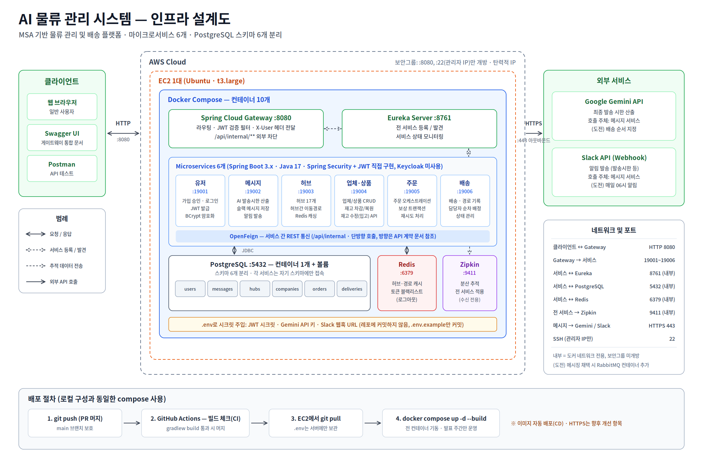
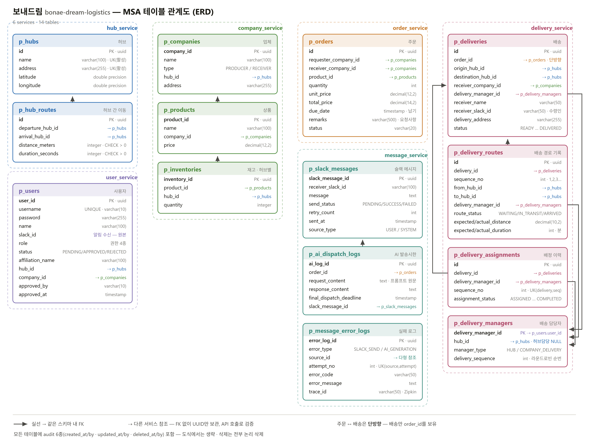

<div align="center">
  <br>
  <h1> 📦 보내드림 물류</h1>
  <strong>MSA 기반 국내 물류 관리 및 배송 시스템</strong>
  <br>
  <em>bonae-dream-logistics</em>
  <br><br>
  <sub>Team <strong>I-이게되네</strong></sub>
</div>
<br>
<p align="center">
  
  
  
  
  
  
  
</p>

<br>

<div align="center">
  
</div>

<br>

전국 **17개 허브 센터**가 여러 업체의 물건을 보관하고, 배송 요청이 오면 출발 허브에서 목적지 허브로 물품을 이동시킨 뒤 최종 업체까지 배송하는 **B2B 물류 플랫폼**입니다. 마이크로서비스 아키텍처(MSA)로 설계되어 서비스별 독립 배포와 확장이 가능합니다.

## 📑 목차

- [팀 소개](#-팀-소개--team-i-이게되네)
- [아키텍처](#-아키텍처)
- [ERD](#-erd)
- [기술 스택](#-기술-스택)
- [시작하기](#-시작하기)
  - [필수 준비물](#필수-준비물)
  - [1. 클론 및 환경변수 설정](#1-클론-및-환경변수-설정)
  - [2. 인프라 기동](#2-인프라-기동)
  - [3. 빌드](#3-빌드)
  - [4. 실행](#4-실행)
  - [5. 동작 확인](#5-동작-확인)
- [API 문서 (Swagger)](#-api-문서-swagger)
- [포트 목록](#-포트-목록)

---

## 👥 팀 소개 — Team I-이게되네

| 담당 | 이름 | GitHub | 역할 |
|:---:|:---:|:---:|---|
| 1 | 황찬혁 | [@kuyhxl](https://github.com/kuyhxl) | 인프라·공통 — Eureka, Gateway, docker-compose, Zipkin, common 모듈, 배포 |
| 2 | 진혜림 | [@Jinhyelim](https://github.com/Jinhyelim) | 유저 서비스 (가입·로그인·JWT), Gateway 인증 필터 · 메시지 서비스 (AI 발송시한, Slack 알림) |
| 3 | 송국희 | [@ssongcookie](https://github.com/ssongcookie) | 허브 서비스 (허브·이동경로, Redis 캐싱) |
| 4 | 황지호 | [@jiho0107](https://github.com/jiho0107) | 업체·상품 서비스 (재고 관리) |
| 5 | 문은서 | [@kosy00](https://github.com/kosy00) | 주문 서비스 (오케스트레이션, 보상 트랜잭션) |
| 6 | 송채영 | [@buddle031](https://github.com/buddle031) | 배송 서비스 (배송경로, 담당자 배정) |

---

## 🏗 아키텍처

외부 요청은 **Gateway(8080)** 단일 지점으로만 들어오며, 각 서비스는 **Eureka**를 통해 서로를 발견합니다. 서비스 간 통신은 OpenFeign(REST)으로, 분산 추적은 Zipkin으로 관측합니다.

<div align="center">
  
</div>

| 서비스 | 포트 | 책임                               |
|---|---|------------------------------------|
| **user-service** | 19001 | 승인 가입, 로그인, JWT 발급        |
| **message-service** | 19002 | AI 발송시한 안내, Slack 알림       |
| **hub-service** | 19003 | 허브 및 허브 간 이동경로           |
| **company-service** | 19004 | 업체·상품 및 재고 관리             |
| **order-service** | 19005 | 주문 오케스트레이션, 보상 트랜잭션 |
| **delivery-service** | 19006 | 배송·배송경로·담당자 배정          |

---

## 🗂 ERD

6개 서비스, 14개 테이블로 구성됩니다. 각 서비스는 **자기 스키마에만** 접속하며, 타 서비스 참조는 **FK 없이 UUID 컬럼만** 보관하고 검증은 API 호출로 처리합니다. 모든 테이블은 audit 6종(`created_at/by`, `updated_at/by`, `deleted_at/by`)을 포함하고 삭제는 전부 논리 삭제입니다.

<div align="center">
  
</div>

---

## 🛠 기술 스택

| 구분 | 사용 기술                                 |
|---|-------------------------------------------|
| 언어 / 런타임 | Java 17                                   |
| 프레임워크 | Spring Boot 3.5.16, Spring Cloud 2025.0.3 |
| 빌드 | Gradle 8.14.3                             |
| 데이터베이스 | PostgreSQL 16                             |
| 캐시 | Redis 7                                   |
| 서비스 디스커버리 | Netflix Eureka                            |
| 게이트웨이 | Spring Cloud Gateway                      |
| 서비스 간 통신 | OpenFeign                                 |
| 인증 / 인가 | Spring Security + JWT, BCrypt             |
| 분산 추적 | Zipkin + Micrometer Tracing (Brave)       |
| API 문서 | Springdoc OpenAPI (Swagger UI)            |
| AI / 알림 | Spring AI + Gemini API, Slack Webhook     |

---

## 🚀 시작하기

### 필수 준비물

| 항목 | 버전 | 확인 |
|---|---|---|
| Java | **17** | `java -version` |
| Docker Desktop | 최신 | `docker --version` |
| Git | - | `git --version` |

### 1. 클론 및 환경변수 설정

```bash
git clone https://github.com/kuyhxl/bonae-dream-logistics.git
cd bonae-dream-logistics

# 환경변수 파일 생성 (필수)
cp .env.template .env
```

> ⚠️ `.env`는 `.gitignore`에 등록되어 커밋되지 않습니다. **반드시 직접 생성**해주세요.

### 2. 인프라 기동

```bash
docker compose up -d
docker compose ps        # 3개 컨테이너가 Up 상태인지 확인
```

| 컨테이너 | 호스트 포트 | 용도 |
|---|---|---|
| `bonae-postgres` | **15432** | PostgreSQL 16 (스키마 6개) |
| `bonae-redis` | 6379 | 캐싱 |
| `bonae-zipkin` | 9411 | 분산 추적 |

> 💡 로컬 PostgreSQL이 5432를 쓰고 있어도 무방합니다 (호스트 포트 15432 사용).
> `.env`를 바꾼 뒤에는 `docker compose down -v && docker compose up -d` — 볼륨이 비어야 계정이 재생성됩니다.

### 3. 빌드

```bash
./gradlew clean build -x test
```

### 4. 실행

> **Eureka를 가장 먼저 띄워주세요.** 이후 순서는 상관없습니다.

```bash
# 터미널 1 — 반드시 먼저
./gradlew :eureka-server:bootRun

# 터미널 2 — 본인 담당 서비스
./gradlew :user-service:bootRun

# 터미널 3 — 게이트웨이 경유 확인이 필요할 때
./gradlew :gateway:bootRun
```

> 💡 IntelliJ에서는 각 `*Application` 클래스의 실행 버튼(▶)을 누르는 게 터미널 여러 개보다 편합니다.

### 5. 동작 확인

```bash
curl localhost:19001/api/users/ping     # 서비스 직접 호출
curl localhost:8080/api/users/ping      # 게이트웨이 경유
```

| 주소 | 용도 |
|---|---|
| http://localhost:8761 | Eureka 대시보드 (등록된 서비스 확인) |
| http://localhost:9411 | Zipkin UI (분산 추적) |

---

## 📖 API 문서 (Swagger)

각 서비스는 Springdoc OpenAPI로 문서화되어 있으며, **게이트웨이 통합 Swagger UI**에서 6개 서비스 문서를 한곳에서 확인할 수 있습니다. 

| 진입점 | 주소 |
|---|---|
| **게이트웨이 통합 UI** | http://localhost:8080/swagger-ui.html |
| 서비스 직접 접속 (예: user) | http://localhost:19001/swagger-ui.html |

> 🔒 서비스 간 내부 API(`/api/internal/**`)는 공개 문서에서 제외됩니다.

---

## 🔌 포트 목록

| 앱 | 포트 | 스키마 |
|---|---|---|
| Gateway | 8080 | - |
| Eureka | 8761 | - |
| user-service | 19001 | `user_service` |
| message-service | 19002 | `message_service` |
| hub-service | 19003 | `hub_service` |
| company-service | 19004 | `company_service` |
| order-service | 19005 | `order_service` |
| delivery-service | 19006 | `delivery_service` |
| PostgreSQL | 15432 | - |
| Redis | 6379 | - |
| Zipkin | 9411 | - |

<br>

<div align="center">
  <strong>Happy Coding</strong> 🚚💨💨
  <br>
  <a href="#-목차">⬆ 목차로 이동</a>
</div>
