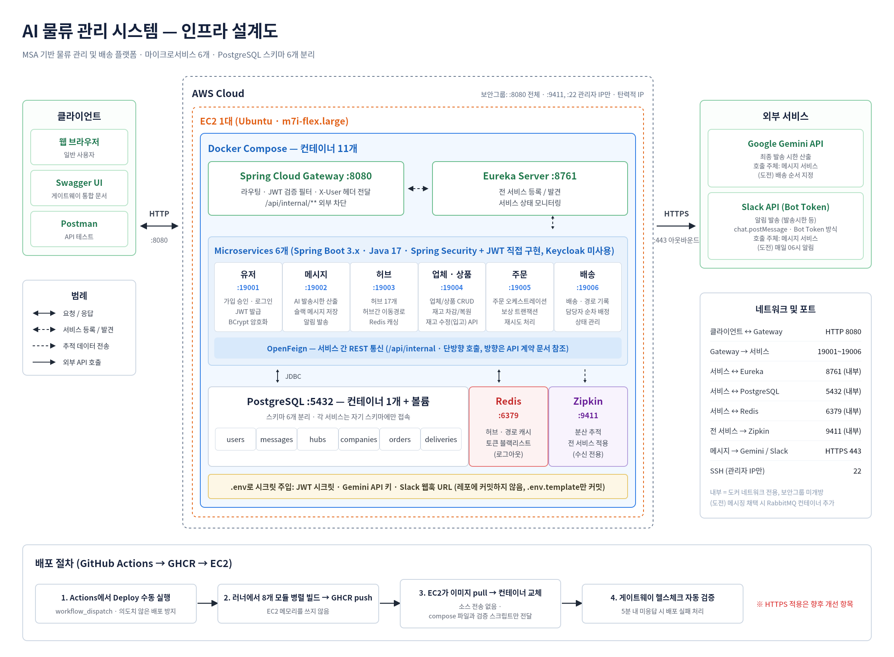
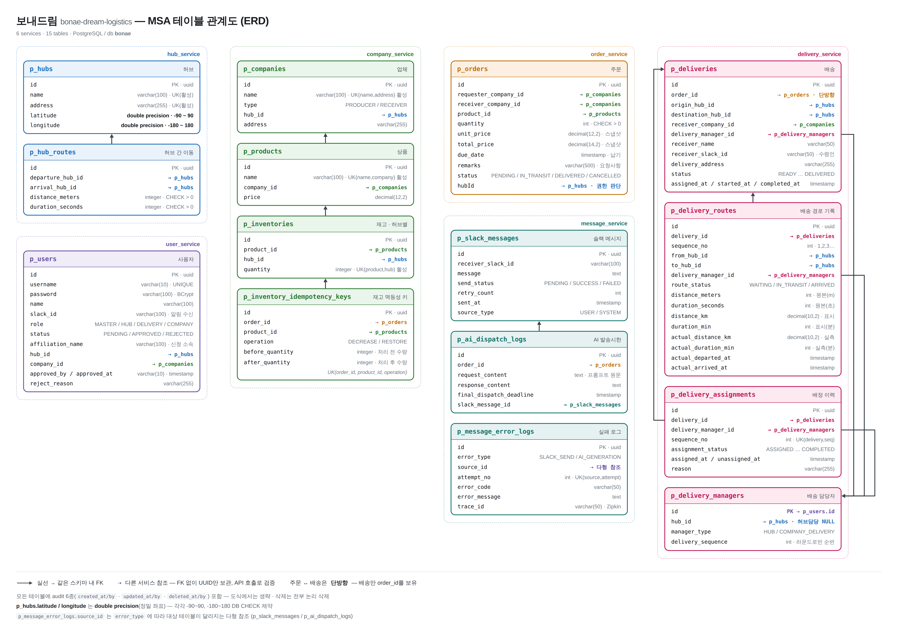

<div align="center">
  <br>
  <h1> 🚛 보내드림 물류</h1>
  <strong>MSA 기반 국내 물류 관리 및 배송 시스템</strong>
  <br>
  <em>bonae-dream-logistics</em>
  <br><br>
  <sub>Team <strong>I-이게되네</strong></sub>
</div>
<br>
<p align="center">
  
  
  
  
  
  
  
</p>

<br>

<div align="center">
  
</div>

<br>

전국 **17개 허브 센터**가 여러 업체의 물건을 보관하고, 배송 요청이 오면 출발 허브에서 목적지 허브로 물품을 이동시킨 뒤 최종 업체까지 배송하는 **B2B 물류 플랫폼**입니다. 마이크로서비스 아키텍처(MSA)로 설계되어 서비스별 독립 배포와 확장이 가능합니다.

## 📑 목차

- [팀 소개](#-팀-소개--team-i-이게되네)
- [프로젝트 소개](#-프로젝트-소개)
  - [프로젝트 목적](#-프로젝트-목적)
  - [프로젝트 상세](#-프로젝트-상세)
- [아키텍처](#-아키텍처)
- [ERD](#-erd)
- [기술 스택](#-기술-스택)
- [시작하기](#-시작하기)
  - [필수 준비물](#필수-준비물)
  - [1. 클론 및 환경변수 설정](#1-클론-및-환경변수-설정)
  - [2. 인프라 기동](#2-인프라-기동)
  - [3. 빌드](#3-빌드)
  - [4. 실행](#4-실행)
  - [5. 동작 확인](#5-동작-확인)
- [시드 데이터](#-시드-데이터)
- [전체 컨테이너 실행](#-전체-컨테이너-실행)
- [API 문서 (Swagger)](#-api-문서-swagger)
- [포트 목록](#-포트-목록)
- [참고 문서](#-참고-문서)

---

## 👥 팀 소개 — Team I-이게되네

| 담당 | 이름 | GitHub | 역할 |
|:---:|:---:|:---:|---|
| 1 | 황찬혁 | [@kuyhxl](https://github.com/kuyhxl) | 인프라·공통 (Eureka, Gateway, Zipkin) |
| 2 | 진혜림 | [@Jinhyelim](https://github.com/Jinhyelim) | 유저·메시지 서비스 (JWT, AI 알림) |
| 3 | 송국희 | [@ssongcookie](https://github.com/ssongcookie) | 허브 서비스 (이동경로, 캐싱) |
| 4 | 황지호 | [@jiho0107](https://github.com/jiho0107) | 업체·상품 서비스 (재고 관리) |
| 5 | 문은서 | [@kosy00](https://github.com/kosy00) | 주문 서비스 (오케스트레이션) |
| 6 | 송채영 | [@buddle031](https://github.com/buddle031) | 배송 서비스 (담당자 배정) |

---

## 📦 프로젝트 소개

> **보내드림 로지스틱스(Bonae Dream Logistics)** — MSA 기반 B2B 물류 관리 및 배송 시스템

전국 17개 허브 센터를 기반으로, 생산업체의 상품이 수령업체에 도착하기까지의
**주문 → 재고 차감 → 허브 간 이동 → 최종 배송**의 전 과정을 관리하는 B2B 물류 플랫폼입니다.

### 🎯 프로젝트 목적

기존 모놀리식 구조의 물류 시스템은 주문이 몰리는 시점에 특정 도메인의 부하가
시스템 전체로 전파되고, 하나의 기능을 수정할 때마다 전체를 재배포해야 하는 한계가 있습니다.

본 프로젝트는 물류 도메인을 **독립적으로 배포·확장 가능한 마이크로서비스로 분리**하여
다음을 달성하는 것을 목표로 합니다.

- **도메인 단위 분리** — 허브 · 업체 · 상품 · 주문 · 배송 · 사용자 · 알림을 독립 서비스로 구성하고, 서비스별 스키마를 분리해 데이터 소유권을 명확히 합니다.
- **장애 격리와 독립 확장** — 트래픽이 집중되는 주문/배송 서비스만 선택적으로 수평 확장할 수 있는 구조를 만듭니다.
- **데이터 일관성 확보** — 서비스 간 API 통신 환경에서 주문·재고·배송이 하나의 흐름으로 처리되도록 트랜잭션과 보상 처리, 재시도 로직을 설계합니다.
- **운영 가시성 확보** — API Gateway를 통한 단일 진입점, Eureka 기반 서비스 디스커버리, Zipkin 분산 추적으로 요청 흐름을 추적 가능하게 합니다.
- **업무 자동화** — 최적 배송 경로를 자동 산출하고, 생성형 AI가 계산한 **최종 발송 시한**을 Slack으로 담당자에게 발송해 납기 지연을 예방합니다.

### 📖 프로젝트 상세

**서비스 구조**

전국 17개 시·도에 허브 센터가 존재하며, 각 허브는 소속 업체의 상품 재고를 보관합니다.
모든 업체는 특정 허브에 소속되며, **생산업체**와 **수령업체**로 구분됩니다.

**배송 프로세스**

1. **주문 생성** — 수령업체가 상품을 주문하면 재고를 차감하고, 재고가 부족하면 주문이 실패합니다.
2. **배송 및 경로 생성** — 주문과 동시에 배송 정보와 **전체 배송 경로가 한 번에** 생성됩니다.
3. **허브 간 이동** — Hub-to-Hub Relay 방식으로 연결된 허브를 순차 경유하며 이동하고, 각 구간은 배송 순번에 따라 허브 배송 담당자에게 순차 배정됩니다.
4. **최종 배송** — 목적지 허브 도착 후, 해당 허브 소속 업체 배송 담당자가 수령업체까지 배송합니다.
5. **알림** — 주문 시점에 AI가 산출한 최종 발송 시한을 발송 허브 담당자에게 Slack으로 전달합니다.

**허브 간 이동 모델 — Hub-to-Hub Relay**

각 허브는 인접한 허브와만 직접 연결되어 있으며, **연결된 허브 간 이동만 가능**합니다.
따라서 멀리 떨어진 허브로 배송할 때는 중간 허브를 릴레이처럼 경유합니다.

- 경기남부 센터, 대전 센터, 대구 센터가 중계 거점 역할을 수행합니다.

  | 허브 | 연결된 허브 |
    | --- | --- |
  | 경기남부 | 경기북부, 서울, 인천, 강원, 경상북도, 대전, 대구 |
  | 대전 | 충청남도, 충청북도, 세종, 전라북도, 광주, 전라남도, 경기남부, 대구 |
  | 대구 | 경상북도, 경상남도, 부산, 울산, 경기남부, 대전 |
  | 경상북도 | 경기남부, 대구 |

- 출발 허브에서 목적지 허브까지의 경로는 **다익스트라 알고리즘**으로 산출하며, 허브 간 이동정보에 저장된 이동거리·소요시간을 가중치로 사용해 최단 경로를 결정합니다.
- 산출된 경로는 배송 경로 기록 엔티티에 **시퀀스 단위로 전부 저장**되어, 각 구간의 예상/실제 거리와 소요시간, 진행 상태를 개별 추적할 수 있습니다.
- 허브 정보와 허브 간 이동정보는 변경 빈도가 낮고 조회가 잦으므로 **Redis 캐싱**을 적용해 경로 탐색 비용을 줄였습니다.

> **예시 — 경기 북부 센터 → 부산 사하구**
>
> 부산의 수산물 도매 업체가 마른오징어 50박스를 주문하면,
> 경기 북부 허브의 재고가 차감되고 →
> `경기북부 → 경기남부 → 대구 → 부산` 순으로 허브 배송 담당자가 릴레이 이동한 뒤 →
> 부산 허브 소속 업체 배송 담당자가 도매 업체까지 최종 배송합니다.

**권한 체계**

| 권한 | 설명 |
| --- | --- |
| `MASTER` | 모든 기능에 대한 권한을 가진 최상위 관리자 |
| `HUB_MANAGER` | 담당 허브와 소속 업체 · 배송 담당자를 관리 |
| `DELIVERY_MANAGER` | 허브 간 배송(허브 담당자) 또는 허브 → 업체 배송(업체 담당자) 수행 |
| `SUPPLIER_MANAGER` | 소속 업체 정보와 해당 업체의 상품을 관리 |

회원가입은 **승인 기반**으로, `PENDING` 상태로 저장된 요청을 마스터 또는 허브 관리자가
승인해야 로그인이 가능합니다. 인증·인가는 API Gateway에서 JWT로 일괄 처리합니다.

**공통 정책**

- 모든 삭제는 `deleted_at` / `deleted_by`를 이용한 **논리적 삭제(Soft Delete)** 로 처리하며, 조회·검색은 `deleted_at IS NULL`인 데이터만 대상으로 합니다.
- 모든 테이블은 `p_` 접두사와 UUID 식별자, 6종 Audit 필드(`created_at/by`, `updated_at/by`, `deleted_at/by`)를 갖습니다.
- 검색은 검색 조건 + 정렬(생성일순 / 수정일순)을 지원하며, 페이지 크기는 10 · 30 · 50건으로 제한됩니다.

## 🏗 아키텍처

외부 요청은 **Gateway(8080)** 단일 지점으로만 들어오며, 각 서비스는 **Eureka**를 통해 서로를 발견합니다. 서비스 간 통신은 OpenFeign(REST)으로, 분산 추적은 Zipkin으로 관측합니다.

<div align="center">
  
</div>

| 서비스 | 포트 | 책임                               |
|---|---|------------------------------------|
| **user-service** | 19001 | 승인 가입, 로그인, JWT 발급        |
| **message-service** | 19002 | AI 발송시한 안내, Slack 알림       |
| **hub-service** | 19003 | 허브 및 허브 간 이동경로           |
| **company-service** | 19004 | 업체·상품 및 재고 관리             |
| **order-service** | 19005 | 주문 오케스트레이션, 보상 트랜잭션 |
| **delivery-service** | 19006 | 배송·배송경로·담당자 배정          |

---

## 🗂 ERD

6개 서비스, 14개 테이블로 구성됩니다. 각 서비스는 **자기 스키마에만** 접속하며, 타 서비스 참조는 **FK 없이 UUID 컬럼만** 보관하고 검증은 API 호출로 처리합니다. 모든 테이블은 audit 6종(`created_at/by`, `updated_at/by`, `deleted_at/by`)을 포함하고 삭제는 전부 논리 삭제입니다.

<div align="center">
  
</div>

---

## 🛠 기술 스택

| 구분 | 사용 기술                                 |
|---|-------------------------------------------|
| 언어 / 런타임 | Java 17                                   |
| 프레임워크 | Spring Boot 3.5.16, Spring Cloud 2025.0.3 |
| 빌드 | Gradle 8.14.3                             |
| 데이터베이스 | PostgreSQL 16                             |
| 캐시 | Redis 7                                   |
| 서비스 디스커버리 | Netflix Eureka                            |
| 게이트웨이 | Spring Cloud Gateway                      |
| 서비스 간 통신 | OpenFeign                                 |
| 인증 / 인가 | Spring Security + JWT, BCrypt             |
| 분산 추적 | Zipkin + Micrometer Tracing (Brave)       |
| API 문서 | Springdoc OpenAPI (Swagger UI)            |
| AI / 알림 | Spring AI + Gemini API, Slack Webhook     |

---

## 🚀 시작하기

### 필수 준비물

| 항목 | 버전 | 확인 |
|---|---|---|
| Java | **17** | `java -version` |
| Docker Desktop | 최신 | `docker --version` |
| Git | - | `git --version` |

### 1. 클론 및 환경변수 설정

```bash
git clone https://github.com/kuyhxl/bonae-dream-logistics.git
cd bonae-dream-logistics

# 환경변수 파일 생성 (필수)
cp .env.template .env
```

> ⚠️ `.env`는 `.gitignore`에 등록되어 커밋되지 않습니다. **반드시 직접 생성**해주세요.

### 2. 인프라 기동

```bash
docker compose up -d postgres redis zipkin
docker compose ps        # 3개 컨테이너가 Up 상태인지 확인
```

| 컨테이너 | 호스트 포트 | 용도 |
|---|---|---|
| `bonae-postgres` | **15432** | PostgreSQL 16 (스키마 6개) |
| `bonae-redis` | 6379 | 캐싱 |
| `bonae-zipkin` | 9411 | 분산 추적 |

> 💡 로컬 PostgreSQL이 5432를 쓰고 있어도 무방합니다 (호스트 포트 15432 사용).
> `.env`를 바꾼 뒤에는 `docker compose down -v && docker compose up -d postgres redis zipkin` — 볼륨이 비어야 계정이 재생성됩니다.

> 📦 애플리케이션까지 컨테이너로 한 번에 띄우려면 [전체 컨테이너 실행](#-전체-컨테이너-실행)을 참고하세요.

### 3. 빌드

```bash
./gradlew clean build -x test
```

### 4. 실행

> **Eureka를 가장 먼저 띄워주세요.** 이후 순서는 상관없습니다.

```bash
# 터미널 1 — 반드시 먼저
./gradlew :eureka-server:bootRun

# 터미널 2 — 본인 담당 서비스
./gradlew :user-service:bootRun

# 터미널 3 — 게이트웨이 경유 확인이 필요할 때
./gradlew :gateway:bootRun
```

> 💡 IntelliJ에서는 각 `*Application` 클래스의 실행 버튼(▶)을 누르는 게 터미널 여러 개보다 편합니다.

### 5. 동작 확인

```bash
curl localhost:19001/api/users/ping     # 서비스 직접 호출
curl localhost:8080/api/users/ping      # 게이트웨이 경유
```

| 주소 | 용도 |
|---|---|
| http://localhost:8761 | Eureka 대시보드 (등록된 서비스 확인) |
| http://localhost:9411 | Zipkin UI (분산 추적) |

---

## 🌱 시드 데이터

기능을 확인할 때마다 계정과 업체를 손으로 만들지 않도록, 검증용 데이터를 한 번에 생성하는 스크립트를 제공합니다. **업체 2개, 역할별 사용자 각각 1명, 배송 담당자 1명**이 만들어집니다.

> 전국 **17개 허브와 이동경로**는 `hub-service`의 마이그레이션(`V3`, `V4`)이 기준 데이터로 넣습니다. 시드 스크립트는 이를 **참조만** 하며 허브를 새로 만들지 않습니다.

```bash
docker compose up -d --build   # 전체 서비스 기동이 먼저 필요합니다!
./scripts/seed-api.sh
```

게이트웨이를 경유해 **실제 REST API를 호출**하므로, 데이터가 만들어지는 과정에서 JWT 인증·권한 검증·헤더 전파·서비스 간 Feign 호출이 함께 검증됩니다. **스크립트가 끝까지 성공 ->  통합 동작을 확인**

> 💡 승인 처리와 역할·소속 부여는 아직 해당 API가 없어 이 부분만 DB를 직접 갱신합니다. 승인 API가 생기면 API 호출로 교체할 예정입니다.

### 생성되는 계정

비밀번호는 모두 `Seed1234!` 입니다.

| 계정 | 역할 | 소속 |
|---|---|---|
| `seedmaster` | MASTER | - |
| `seedhub` | HUB_MANAGER | 서울특별시 센터 |
| `seedcomp` | COMPANY_MANAGER | 시드 생산업체 |
| `seeddeli` | DELIVERY_MANAGER | 서울특별시 센터 |

```bash
# 토큰 발급 예시
curl -s -X POST localhost:8080/api/auth/login \
  -H 'Content-Type: application/json' \
  -d '{"username":"seedmaster","password":"Seed1234!"}'
```

> ⚠️ 로컬 개발 전용 계정입니다. **여러 번 실행해도 안전**하며(이미 있으면 재사용), 허브를 포함해 기존 데이터를 변경하지 않습니다.

### 통합 검증

시드 데이터를 만든 뒤 `verify.sh`로 시나리오를 확인할 수 있습니다.

```bash
./scripts/seed-api.sh     # 데이터 준비
./scripts/verify.sh       # 검증 실행
```

**통과해야 할 것과 막혀야 할 것을 함께** 확인합니다. 실패가 하나라도 있으면 종료 코드 1을 반환합니다.

| 구분 | 확인 항목                                                                                            |
|---|------------------------------------------------------------------------------------------------------|
| 레벨 1 | Eureka 등록, 마이그레이션 적용, 기준 허브 17개                                                       |
| 레벨 2 | 토큰 발급·검증, **토큰 없음/위조 -> 401**, **헤더 위조 차단**, 로그아웃 블랙리스트, 토큰 재발급(RTR) |
| 레벨 3 | 역할별 권한 분기(**403**), 도메인 조회, 잘못된 요청 처리(400/404/405)                                |
| 레벨 4 | 서비스 간 Feign 연동                                                                                 |
| 관측 | Zipkin 트레이스 수집                                                                                 |

아직 구현되지 않은 항목은 **건너뜀(`-`)** 으로 표시되며 실패로 집계되지 않습니다.

> 💡 검증 과정에서 만든 업체는 **실행이 끝나면 자동으로 삭제**됩니다. 중간에 중단해도 남지 않으며(`trap`), 실행마다 고유 태그를 쓰므로 시드 데이터나 직접 만든 데이터는 건드리지 않습니다.

> 🖥 **Windows 사용자는 Git Bash 또는 WSL에서 실행**해주세요. macOS·Linux는 기본 터미널에서 그대로 동작합니다.
> `docker`, `curl`, `sed`, `grep`만 있으면 되며, 스크립트가 시작할 때 확인합니다.

---

## 📦 전체 컨테이너 실행

인프라와 애플리케이션 8개를 한 번에 띄웁니다. **통합 테스트나 전체 흐름 확인이 필요할 때** 사용하세요.

```bash
docker compose up -d --build      # 최초 실행 (이미지 빌드 포함)
docker compose ps                 # 11개 컨테이너 상태 확인
```

| 자주 쓰는 명령 | 설명 |
|---|---|
| `docker compose logs -f gateway` | 특정 서비스 로그 실시간 확인 |
| `docker compose restart user-service` | 한 서비스만 재시작 |
| `docker compose up -d --build hub-service` | 코드 수정 후 해당 서비스만 재빌드 |
| `docker compose down` | 전체 종료 (데이터 유지) |
| `docker compose down -v` | 전체 종료 + 볼륨 삭제 |

### 로컬 실행과의 차이

| | 로컬 (`bootRun` / IDE) | 컨테이너 (`docker compose`) |
|---|---|---|
| 활성 프로파일 | 기본값 | `docker` |
| DB 주소 | `localhost:15432` | `postgres:5432` |
| Eureka | `localhost:8761` | `eureka-server:8761` |
| Redis / Zipkin | `localhost` | `redis` / `zipkin` |

각 서비스의 `application-docker.yaml`이 컨테이너 환경 호스트를 덮어씁니다.
기본 `application.yaml`은 **로컬 개발 기준을 그대로 유지**하므로, IDE 실행 방식은 변하지 않습니다.

### 개발 중 권장 방식

전체 컨테이너 실행은 코드를 고칠 때마다 재빌드가 필요해 개발 루프가 느립니다.
**평소에는 인프라만 컨테이너로 띄우고 서비스는 IDE에서 실행**하는 편이 빠릅니다.

```bash
docker compose up -d postgres redis zipkin   # 인프라만
./gradlew :user-service:bootRun              # 담당 서비스는 IDE/터미널에서
```

> ⚠️ `JWT_SECRET`은 게이트웨이와 user-service가 **같은 값**을 써야 서명 검증이 성립합니다.
> `.env` 하나로 양쪽에 주입되므로 별도 설정은 필요 없습니다.

---

## 📖 API 문서 (Swagger)

각 서비스는 Springdoc OpenAPI로 문서화되어 있으며, **게이트웨이 통합 Swagger UI**에서 6개 서비스 문서를 한곳에서 확인할 수 있습니다. 

| 진입점 | 주소 |
|---|---|
| **게이트웨이 통합 UI** | http://localhost:8080/swagger-ui.html |
| 서비스 직접 접속 (예: user) | http://localhost:19001/swagger-ui.html |

> 🔒 서비스 간 내부 API(`/api/internal/**`)는 공개 문서에서 제외됩니다.

---

## 🔌 포트 목록

| 앱 | 포트 | 스키마 |
|---|---|---|
| Gateway | 8080 | - |
| Eureka | 8761 | - |
| user-service | 19001 | `user_service` |
| message-service | 19002 | `message_service` |
| hub-service | 19003 | `hub_service` |
| company-service | 19004 | `company_service` |
| order-service | 19005 | `order_service` |
| delivery-service | 19006 | `delivery_service` |
| PostgreSQL | 15432 | - |
| Redis | 6379 | - |
| Zipkin | 9411 | - |

<br>

---

## 📚 참고 문서

#### [팀 노션 (기획 · 설계 · 회의록)](https://app.notion.com/p/3adfc4e83ead816eacf9dd00695024e8?source=copy_link)

<div align="center">
  <strong>Happy Coding</strong> 🚚💨💨
  <br>
  <a href="#-목차">⬆ 목차로 이동</a>
</div>
